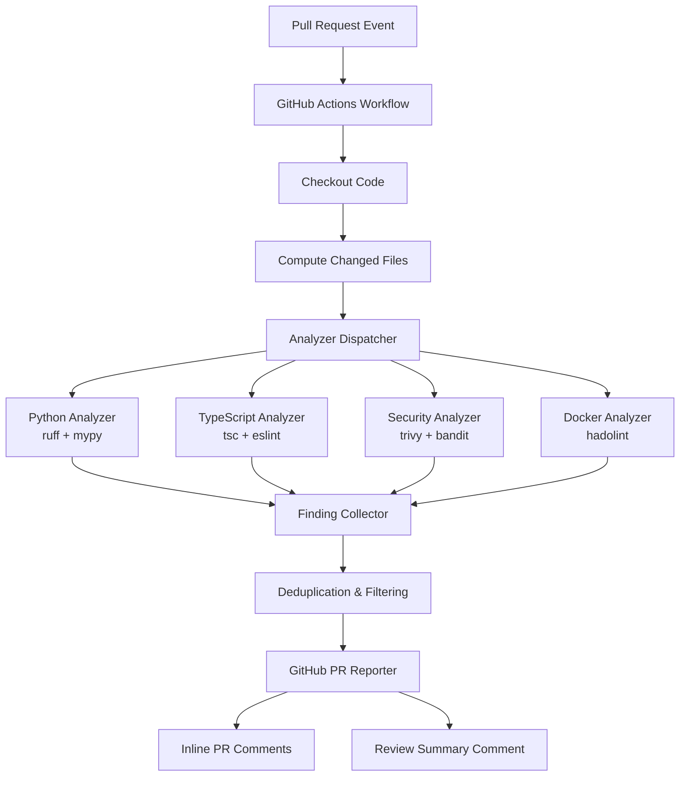
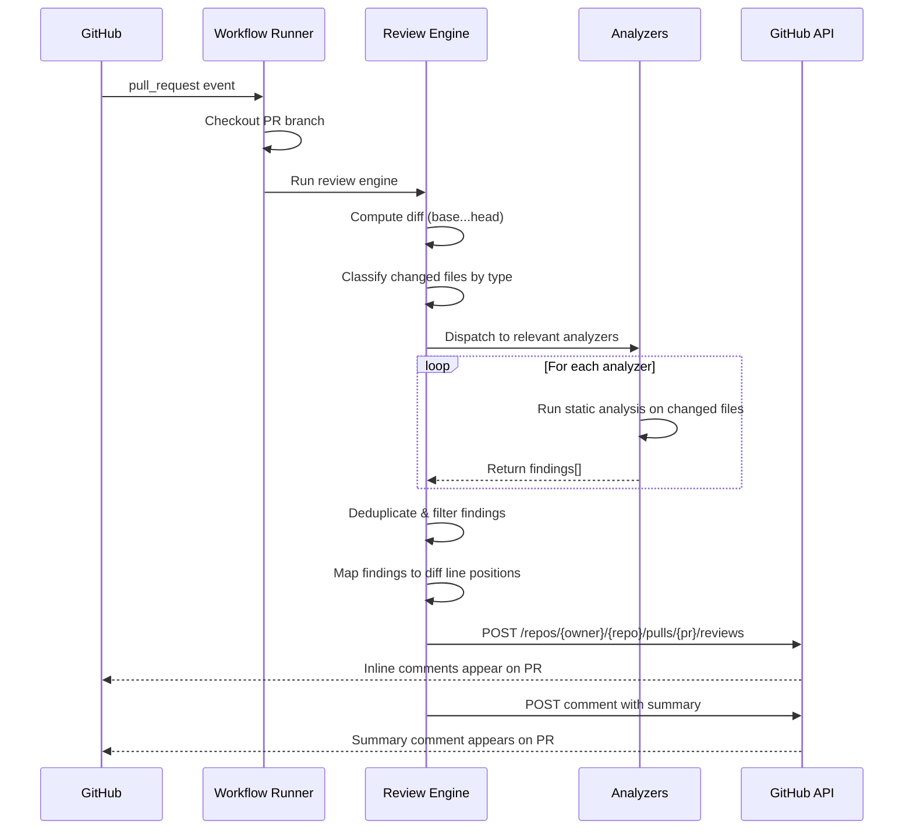
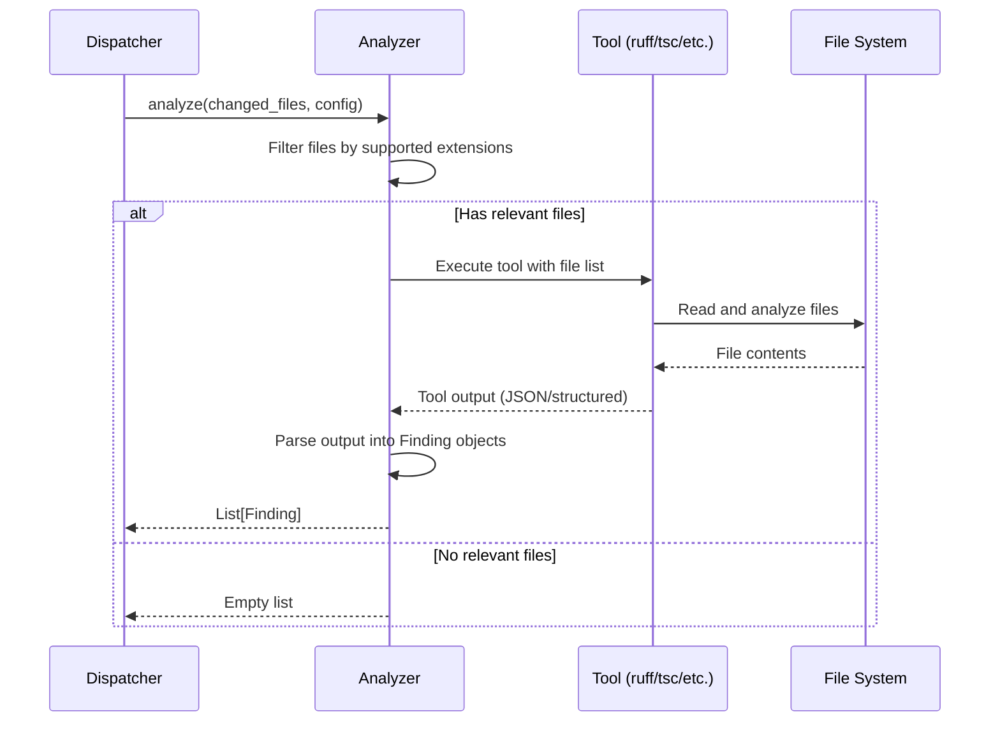

# Design Document: Automated Code Review

## Overview

StreamLens needs an automated code review pipeline that runs on every pull request, inspects the actual changed files, identifies real issues (security vulnerabilities, bugs, style violations, performance concerns), and posts file-level findings as inline PR comments. The current GitHub Actions workflow attempts to use an external CLI tool that failed to load its analysis tools, producing only a generic checklist instead of actionable, file-specific feedback.

This design replaces the broken CLI-based approach with a self-contained Python review engine that runs as a GitHub Actions workflow. The engine uses a pluggable analyzer architecture: each analyzer (Python linting, TypeScript checking, security scanning, etc.) inspects the diff, produces structured findings, and a reporter module posts them as PR review comments via the GitHub API. No external AI services are required for the core pipeline — the system relies on deterministic static analysis tools already available in the ecosystem (ruff, mypy, eslint, trivy), with an optional LLM-based analyzer for higher-level architectural feedback.

The solution is designed to be fast (only analyzes changed files), accurate (no generic checklists — every finding references a specific file and line), and extensible (new analyzers can be added by implementing a simple interface).

## Architecture



## Sequence Diagrams

### Main Review Flow



### Analyzer Execution Detail



## Components and Interfaces

### Component 1: Review Engine (Orchestrator)

**Purpose**: Entry point that coordinates the entire review process — computes the diff, dispatches analyzers, collects findings, and triggers reporting.

```python
from dataclasses import dataclass, field
from enum import Enum
from pathlib import Path


class Severity(Enum):
    ERROR = "error"
    WARNING = "warning"
    INFO = "info"


@dataclass
class Finding:
    """A single code review finding tied to a specific file and line."""
    file: str
    line: int
    severity: Severity
    message: str
    analyzer: str
    rule_id: str | None = None
    suggestion: str | None = None
    end_line: int | None = None


@dataclass
class ReviewConfig:
    """Configuration for a review run."""
    repo_root: Path
    base_ref: str
    head_ref: str
    changed_files: list[str] = field(default_factory=list)
    severity_threshold: Severity = Severity.WARNING
    max_comments: int = 50


@dataclass
class ReviewResult:
    """Aggregated result of all analyzers."""
    findings: list[Finding] = field(default_factory=list)
    summary: dict[str, int] = field(default_factory=dict)  # analyzer -> count
    errors: list[str] = field(default_factory=list)  # analyzer failures
```

**Responsibilities**:
- Parse GitHub event payload to extract PR metadata
- Compute the list of changed files from the git diff
- Classify files by type (Python, TypeScript, Docker, YAML, etc.)
- Dispatch files to the appropriate analyzers
- Collect and deduplicate findings
- Enforce the max comment limit to avoid spamming PRs

### Component 2: Analyzer Interface (Abstract Base)

**Purpose**: Defines the contract that all analyzers must implement. Each analyzer wraps a specific static analysis tool.

```python
from abc import ABC, abstractmethod


class BaseAnalyzer(ABC):
    """Interface for all code review analyzers."""

    @property
    @abstractmethod
    def name(self) -> str:
        """Human-readable analyzer name."""
        ...

    @property
    @abstractmethod
    def supported_extensions(self) -> set[str]:
        """File extensions this analyzer handles (e.g., {'.py', '.pyi'})."""
        ...

    @abstractmethod
    def analyze(self, files: list[str], config: ReviewConfig) -> list[Finding]:
        """
        Run analysis on the given files and return findings.
        
        Args:
            files: List of file paths relative to repo root.
            config: Review configuration with repo root and settings.
            
        Returns:
            List of Finding objects for issues detected.
        """
        ...

    def is_available(self) -> bool:
        """Check if the underlying tool is installed and available."""
        ...
```

**Responsibilities**:
- Define a uniform interface for all analyzers
- Allow the dispatcher to treat all analyzers polymorphically
- Support availability checking so missing tools degrade gracefully

### Component 3: Analyzer Dispatcher

**Purpose**: Routes changed files to the correct analyzers based on file extension, runs them in parallel where possible, and collects results.

```python
class AnalyzerDispatcher:
    """Routes files to appropriate analyzers and collects findings."""

    def __init__(self, analyzers: list[BaseAnalyzer]) -> None:
        self._analyzers = analyzers

    def dispatch(self, changed_files: list[str], config: ReviewConfig) -> ReviewResult:
        """
        Run all relevant analyzers against the changed files.
        
        Returns aggregated ReviewResult with all findings.
        """
        ...

    def _match_analyzers(self, file: str) -> list[BaseAnalyzer]:
        """Return analyzers whose supported_extensions match the file."""
        ...
```

**Responsibilities**:
- Map file extensions to analyzers
- Skip analyzers that aren't available (tool not installed)
- Run analyzers and catch individual failures without aborting the whole review
- Aggregate findings into a single ReviewResult

### Component 4: GitHub PR Reporter

**Purpose**: Takes the aggregated findings and posts them to the pull request as inline review comments and a summary comment.

```python
@dataclass
class DiffMapping:
    """Maps a file+line to a diff position for the GitHub review API."""
    file: str
    line: int
    diff_position: int


class GitHubReporter:
    """Posts review findings as inline PR comments via the GitHub API."""

    def __init__(self, token: str, repo: str, pr_number: int, commit_sha: str) -> None:
        self._token = token
        self._repo = repo
        self._pr_number = pr_number
        self._commit_sha = commit_sha

    def post_review(self, result: ReviewResult, diff_mappings: list[DiffMapping]) -> None:
        """
        Post findings as a single PR review with inline comments.
        
        Uses the GitHub Pull Request Review API to post all comments
        atomically as one review, rather than individual comments.
        """
        ...

    def post_summary(self, result: ReviewResult) -> None:
        """Post a summary comment with finding counts by severity and analyzer."""
        ...

    def _build_review_comments(
        self, findings: list[Finding], diff_mappings: list[DiffMapping]
    ) -> list[dict]:
        """Convert findings to GitHub review comment format, filtering to diff-visible lines."""
        ...
```

**Responsibilities**:
- Map findings to diff positions (GitHub requires position-in-diff, not absolute line numbers)
- Filter out findings on lines not visible in the diff
- Post a single atomic review with all inline comments
- Post a summary comment with counts and pass/fail status
- Handle GitHub API rate limits and errors gracefully

### Component 5: Concrete Analyzers

**Purpose**: Implementations of BaseAnalyzer for each tool in the pipeline.

```python
class RuffAnalyzer(BaseAnalyzer):
    """Python linting and formatting via ruff."""

    @property
    def name(self) -> str:
        return "ruff"

    @property
    def supported_extensions(self) -> set[str]:
        return {".py", ".pyi"}

    def analyze(self, files: list[str], config: ReviewConfig) -> list[Finding]:
        """Run ruff check --output-format=json on the given Python files."""
        ...


class MypyAnalyzer(BaseAnalyzer):
    """Python type checking via mypy."""

    @property
    def name(self) -> str:
        return "mypy"

    @property
    def supported_extensions(self) -> set[str]:
        return {".py", ".pyi"}

    def analyze(self, files: list[str], config: ReviewConfig) -> list[Finding]:
        """Run mypy with JSON output on the given Python files."""
        ...


class TypeScriptAnalyzer(BaseAnalyzer):
    """TypeScript type checking and linting."""

    @property
    def name(self) -> str:
        return "typescript"

    @property
    def supported_extensions(self) -> set[str]:
        return {".ts", ".tsx"}

    def analyze(self, files: list[str], config: ReviewConfig) -> list[Finding]:
        """Run tsc --noEmit and parse diagnostics for changed files."""
        ...


class SecurityAnalyzer(BaseAnalyzer):
    """Security scanning via bandit (Python) and trivy (general)."""

    @property
    def name(self) -> str:
        return "security"

    @property
    def supported_extensions(self) -> set[str]:
        return {".py", ".ts", ".tsx", ".js", ".yml", ".yaml", ".dockerfile"}

    def analyze(self, files: list[str], config: ReviewConfig) -> list[Finding]:
        """Run bandit on Python files and trivy fs on the repo."""
        ...


class DockerAnalyzer(BaseAnalyzer):
    """Dockerfile linting via hadolint."""

    @property
    def name(self) -> str:
        return "docker"

    @property
    def supported_extensions(self) -> set[str]:
        return {".dockerfile"}

    def analyze(self, files: list[str], config: ReviewConfig) -> list[Finding]:
        """Run hadolint on Dockerfiles."""
        ...

    def _match_dockerfiles(self, files: list[str]) -> list[str]:
        """Match files named 'Dockerfile' or '*.dockerfile'."""
        ...
```

## Data Models

### Finding Model

```python
@dataclass
class Finding:
    file: str                        # Relative path from repo root
    line: int                        # 1-based line number
    severity: Severity               # ERROR, WARNING, INFO
    message: str                     # Human-readable description
    analyzer: str                    # Which analyzer produced this
    rule_id: str | None = None       # Tool-specific rule ID (e.g., "E501", "TS2345")
    suggestion: str | None = None    # Optional fix suggestion
    end_line: int | None = None      # For multi-line findings
```

**Validation Rules**:
- `file` must be a valid relative path that exists in the repo
- `line` must be >= 1
- `message` must be non-empty
- `analyzer` must match a registered analyzer name
- `end_line`, if set, must be >= `line`

### Review Summary Model

```python
@dataclass
class ReviewSummary:
    total_findings: int
    by_severity: dict[Severity, int]       # {ERROR: 3, WARNING: 5, INFO: 2}
    by_analyzer: dict[str, int]            # {"ruff": 4, "mypy": 2, "security": 4}
    files_reviewed: int
    files_with_findings: int
    pass_status: bool                      # True if no ERROR-level findings
    duration_seconds: float
    analyzer_errors: list[str]             # Analyzers that failed to run
```

### GitHub Event Context

```python
@dataclass
class PRContext:
    """Extracted from GITHUB_EVENT_PATH and environment variables."""
    owner: str
    repo: str
    pr_number: int
    base_sha: str
    head_sha: str
    token: str                             # GITHUB_TOKEN
```

## Algorithmic Pseudocode

### Main Review Algorithm

```python
def run_review(pr_context: PRContext) -> ReviewResult:
    """
    Main entry point for the automated code review.
    
    Preconditions:
        - pr_context contains valid GitHub PR metadata
        - GITHUB_TOKEN has pull-requests:write permission
        - Repository is checked out with full history for diff
    
    Postconditions:
        - All changed files have been analyzed by relevant analyzers
        - Findings are posted as inline PR review comments
        - A summary comment is posted on the PR
        - Returns ReviewResult with all findings
    """
    # Step 1: Compute changed files from the diff
    changed_files = git_diff_files(pr_context.base_sha, pr_context.head_sha)
    
    if not changed_files:
        post_summary_comment(pr_context, "No files changed — nothing to review.")
        return ReviewResult(findings=[], summary={})
    
    # Step 2: Build review config
    config = ReviewConfig(
        repo_root=Path.cwd(),
        base_ref=pr_context.base_sha,
        head_ref=pr_context.head_sha,
        changed_files=changed_files,
    )
    
    # Step 3: Initialize analyzers and dispatch
    analyzers = [
        RuffAnalyzer(),
        MypyAnalyzer(),
        TypeScriptAnalyzer(),
        SecurityAnalyzer(),
        DockerAnalyzer(),
    ]
    dispatcher = AnalyzerDispatcher(
        analyzers=[a for a in analyzers if a.is_available()]
    )
    result = dispatcher.dispatch(changed_files, config)
    
    # Step 4: Compute diff mappings for inline comments
    diff_mappings = compute_diff_positions(pr_context.base_sha, pr_context.head_sha)
    
    # Step 5: Filter findings to only those visible in the diff
    visible_findings = filter_to_diff_lines(result.findings, diff_mappings)
    
    # Step 6: Enforce max comment limit (prioritize by severity)
    if len(visible_findings) > config.max_comments:
        visible_findings = prioritize_findings(visible_findings, config.max_comments)
    
    # Step 7: Post review
    reporter = GitHubReporter(
        token=pr_context.token,
        repo=f"{pr_context.owner}/{pr_context.repo}",
        pr_number=pr_context.pr_number,
        commit_sha=pr_context.head_sha,
    )
    reporter.post_review(
        ReviewResult(findings=visible_findings, summary=result.summary),
        diff_mappings,
    )
    reporter.post_summary(result)
    
    return result
```

### Diff Position Mapping Algorithm

```python
def compute_diff_positions(base_sha: str, head_sha: str) -> list[DiffMapping]:
    """
    Parse unified diff output to map file+line to diff positions.
    
    Preconditions:
        - base_sha and head_sha are valid git commit references
        - Repository has both commits available
    
    Postconditions:
        - Returns a DiffMapping for every added/modified line in the diff
        - diff_position values are 1-based, counting from the start of each file's diff hunk
    
    Loop Invariant:
        - position counter increments for every line in the diff output
          (context lines, additions, and deletions all count)
        - Only addition lines (+) generate a DiffMapping entry
    """
    diff_output = run_git("diff", f"{base_sha}...{head_sha}", "--unified=3")
    mappings = []
    current_file = None
    position = 0
    current_new_line = 0
    
    for raw_line in diff_output.splitlines():
        if raw_line.startswith("diff --git"):
            # New file in diff
            current_file = parse_file_path(raw_line)
            position = 0
        elif raw_line.startswith("@@"):
            # New hunk — extract starting line number
            current_new_line = parse_hunk_header(raw_line)
            position += 1
        elif raw_line.startswith("+") and not raw_line.startswith("+++"):
            # Added line — this is reviewable
            position += 1
            mappings.append(DiffMapping(
                file=current_file,
                line=current_new_line,
                diff_position=position,
            ))
            current_new_line += 1
        elif raw_line.startswith("-") and not raw_line.startswith("---"):
            # Deleted line — counts toward position but no mapping
            position += 1
        else:
            # Context line
            position += 1
            current_new_line += 1
    
    return mappings
```

### Finding Prioritization Algorithm

```python
def prioritize_findings(findings: list[Finding], max_count: int) -> list[Finding]:
    """
    Select the most important findings when the total exceeds max_count.
    
    Preconditions:
        - len(findings) > max_count
        - max_count > 0
    
    Postconditions:
        - Returns exactly max_count findings
        - ERROR findings are always included first
        - Within same severity, security findings take priority
        - Original file order is preserved within each priority group
    """
    severity_order = {Severity.ERROR: 0, Severity.WARNING: 1, Severity.INFO: 2}
    analyzer_priority = {"security": 0, "ruff": 1, "mypy": 1, "typescript": 1, "docker": 2}
    
    sorted_findings = sorted(
        findings,
        key=lambda f: (
            severity_order.get(f.severity, 3),
            analyzer_priority.get(f.analyzer, 3),
        ),
    )
    
    return sorted_findings[:max_count]
```

## Key Functions with Formal Specifications

### Function: git_diff_files()

```python
def git_diff_files(base_sha: str, head_sha: str) -> list[str]:
    """Return list of files changed between base and head commits."""
    ...
```

**Preconditions:**
- `base_sha` and `head_sha` are valid git references (commit SHAs or branch names)
- The current working directory is inside a git repository
- Both commits are reachable in the repository history

**Postconditions:**
- Returns a list of relative file paths (from repo root)
- Only includes files that exist at `head_sha` (deleted files are excluded)
- Paths use forward slashes regardless of OS
- No duplicates in the returned list

**Loop Invariants:** N/A

### Function: filter_to_diff_lines()

```python
def filter_to_diff_lines(
    findings: list[Finding], diff_mappings: list[DiffMapping]
) -> list[Finding]:
    """Keep only findings on lines that appear in the diff."""
    ...
```

**Preconditions:**
- All findings have valid `file` and `line` fields
- `diff_mappings` covers all added/modified lines in the diff

**Postconditions:**
- Every returned finding has a corresponding DiffMapping (same file and line)
- Findings on unchanged lines are excluded
- The relative order of findings is preserved

**Loop Invariants:**
- For each processed finding: it is included if and only if `(finding.file, finding.line)` exists in the diff_mappings set

### Function: AnalyzerDispatcher.dispatch()

```python
def dispatch(self, changed_files: list[str], config: ReviewConfig) -> ReviewResult:
    """Run all relevant analyzers and aggregate results."""
    ...
```

**Preconditions:**
- `changed_files` is non-empty
- All analyzers in `self._analyzers` have passed `is_available()` check
- `config.repo_root` points to a valid repository root

**Postconditions:**
- Every file in `changed_files` is analyzed by all analyzers whose `supported_extensions` match
- If an analyzer raises an exception, the error is captured in `result.errors` and other analyzers continue
- `result.summary` contains accurate counts per analyzer
- No analyzer is called with an empty file list

**Loop Invariants:**
- After processing analyzer `i`: `result.findings` contains all findings from analyzers `0..i`
- After processing analyzer `i`: `result.errors` contains error messages from any failed analyzers in `0..i`

## Example Usage

```python
# Example 1: Running the review from GitHub Actions
import json
import os
from pathlib import Path

# Parse GitHub event
event_path = os.environ["GITHUB_EVENT_PATH"]
with open(event_path) as f:
    event = json.load(f)

pr_context = PRContext(
    owner=event["repository"]["owner"]["login"],
    repo=event["repository"]["name"],
    pr_number=event["pull_request"]["number"],
    base_sha=event["pull_request"]["base"]["sha"],
    head_sha=event["pull_request"]["head"]["sha"],
    token=os.environ["GITHUB_TOKEN"],
)

result = run_review(pr_context)
print(f"Found {len(result.findings)} issues across {len(result.summary)} analyzers")

# Exit with non-zero if there are errors (optional — for blocking PRs)
error_count = sum(1 for f in result.findings if f.severity == Severity.ERROR)
if error_count > 0:
    sys.exit(1)
```

```python
# Example 2: Running a single analyzer locally for testing
config = ReviewConfig(
    repo_root=Path("."),
    base_ref="main",
    head_ref="HEAD",
    changed_files=["server/src/ai.py", "server/main.py"],
)

analyzer = RuffAnalyzer()
if analyzer.is_available():
    findings = analyzer.analyze(config.changed_files, config)
    for f in findings:
        print(f"{f.file}:{f.line} [{f.severity.value}] {f.message} ({f.rule_id})")
```

```python
# Example 3: GitHub Actions workflow usage (YAML)
# .github/workflows/code-review.yml
"""
name: Automated Code Review
on:
  pull_request:
    branches: [main, master]

permissions:
  contents: read
  pull-requests: write

jobs:
  review:
    runs-on: ubuntu-latest
    steps:
      - uses: actions/checkout@v4
        with:
          fetch-depth: 0  # Full history for diff

      - uses: actions/setup-python@v5
        with:
          python-version: "3.12"

      - name: Install review tools
        run: |
          pip install ruff bandit mypy
          npm install -g typescript

      - name: Run automated review
        env:
          GITHUB_TOKEN: ${{ secrets.GITHUB_TOKEN }}
        run: python tools/review/run_review.py
"""
```

## Correctness Properties

*A property is a characteristic or behavior that should hold true across all valid executions of a system — essentially, a formal statement about what the system should do. Properties serve as the bridge between human-readable specifications and machine-verifiable correctness guarantees.*

### Property 1: Deleted file exclusion

*For any* set of file change records produced by a git diff (including added, modified, and deleted files), the Review_Engine's changed file list SHALL contain only files that exist at the head SHA, with all deleted files excluded.

**Validates: Requirement 1.2**

### Property 2: Dispatch completeness

*For any* set of changed files and any set of available analyzers, the Analyzer_Dispatcher SHALL route each file to every analyzer whose supported_extensions set includes that file's extension, and no analyzer SHALL be called with an empty file list or with files whose extensions it does not support.

**Validates: Requirements 2.1, 2.3**

### Property 3: Analyzer availability filtering

*For any* set of analyzers where some have is_available() returning False, the Analyzer_Dispatcher SHALL invoke only the available analyzers and skip all unavailable ones, while still producing findings from the available analyzers.

**Validates: Requirements 2.2, 7.2**

### Property 4: Finding aggregation accuracy

*For any* set of findings returned by individual analyzers, the aggregated ReviewResult SHALL contain all findings from all analyzers and the per-analyzer summary counts SHALL equal the number of findings each analyzer produced.

**Validates: Requirement 2.4**

### Property 5: Diff mapping correctness

*For any* valid unified diff output, every DiffMapping produced by compute_diff_positions SHALL reference a line that is an added or modified line in the diff, with the correct file path, new-file line number, and 1-based diff position. Conversely, every added or modified line in the diff SHALL have a corresponding DiffMapping.

**Validates: Requirements 4.1, 4.2**

### Property 6: Finding-to-diff filtering

*For any* list of findings and any set of diff mappings, filter_to_diff_lines SHALL return only findings whose (file, line) pair has a corresponding DiffMapping, and findings on lines not in the diff SHALL be excluded from inline comments but still counted in the summary.

**Validates: Requirements 4.3, 5.1, 7.5**

### Property 7: Prioritization severity and analyzer ordering

*For any* list of findings that exceeds max_comments, the prioritized output SHALL have all ERROR-severity findings before any WARNING-severity findings, and all WARNING before INFO. Within the same severity level, security analyzer findings SHALL appear before findings from other analyzers.

**Validates: Requirements 5.2, 5.3**

### Property 8: Prioritization count enforcement

*For any* list of findings where the count exceeds max_comments, the prioritize_findings function SHALL return exactly max_comments findings.

**Validates: Requirement 5.4**

### Property 9: Prioritization stability

*For any* list of findings, the prioritization function SHALL preserve the relative order of findings within the same priority group (same severity and same analyzer priority tier).

**Validates: Requirement 5.5**

### Property 10: Pass/fail status correctness

*For any* ReviewResult, the pass_status SHALL be False if and only if at least one finding has ERROR severity, and True otherwise.

**Validates: Requirement 6.3**

### Property 11: Graceful degradation on analyzer failure

*For any* set of analyzers where one or more raise exceptions during analyze(), the Analyzer_Dispatcher SHALL catch each exception, record the error in ReviewResult.errors, and continue running all remaining analyzers to completion.

**Validates: Requirement 7.1**

### Property 12: Finding data validity

*For any* Finding object produced by the system, the file field SHALL be non-empty, the line field SHALL be greater than or equal to 1, the message field SHALL be non-empty, the analyzer field SHALL match a registered analyzer name, and if end_line is set it SHALL be greater than or equal to line.

**Validates: Requirements 8.1, 8.2, 8.3, 8.4, 8.5**

### Property 13: File path validation for subprocess safety

*For any* file path passed to an analyzer subprocess, the Review_Engine SHALL validate the path is a safe relative path (no path traversal sequences, no absolute paths) before execution.

**Validates: Requirement 9.3**

### Property 14: Review determinism

*For any* PR context and commit SHA, running the Review_Engine twice with the same analyzer versions and configuration SHALL produce the same set of findings in the same order.

**Validates: Requirement 10.1**

## Error Handling

### Error Scenario 1: Analyzer Tool Not Installed

**Condition**: An analyzer's underlying tool (e.g., ruff, mypy) is not available on the runner.
**Response**: `is_available()` returns `False`; the dispatcher skips this analyzer entirely.
**Recovery**: The summary comment notes which analyzers were skipped due to missing tools. Other analyzers run normally.

### Error Scenario 2: Analyzer Crashes During Execution

**Condition**: An analyzer raises an unhandled exception (e.g., tool returns unexpected output format, file encoding issue).
**Response**: The dispatcher catches the exception, logs it, and adds the error message to `ReviewResult.errors`.
**Recovery**: Remaining analyzers continue. The summary comment includes a warning about the failed analyzer.

### Error Scenario 3: GitHub API Rate Limit

**Condition**: The GitHub API returns HTTP 403 with rate limit headers.
**Response**: The reporter retries with exponential backoff (up to 3 retries, starting at 5 seconds).
**Recovery**: If retries are exhausted, the review posts a single summary comment instead of inline comments, noting that rate limits prevented inline feedback.

### Error Scenario 4: No Changed Files

**Condition**: The PR diff contains no file changes (e.g., merge commit with no new changes).
**Response**: The engine posts a brief summary comment ("No files changed — nothing to review.") and exits successfully.
**Recovery**: N/A — this is a normal exit path.

### Error Scenario 5: Diff Position Mapping Failure

**Condition**: A finding's file+line cannot be mapped to a diff position (line exists but is outside the diff context).
**Response**: The finding is excluded from inline comments but still counted in the summary.
**Recovery**: The summary comment includes the total count of findings, noting how many could not be posted inline.

## Testing Strategy

### Unit Testing Approach

Each component is tested in isolation with mocked dependencies:

- **Finding model tests**: Validate construction, serialization, and validation rules.
- **Diff parser tests**: Feed known unified diff strings into `compute_diff_positions` and verify correct mappings.
- **Analyzer tests**: Mock subprocess calls to each tool, feed known JSON output, and verify correct Finding objects are produced.
- **Dispatcher tests**: Mock analyzers, verify correct routing by file extension, verify error handling when an analyzer throws.
- **Reporter tests**: Mock the GitHub API (httpx), verify correct request payloads for reviews and comments.
- **Prioritization tests**: Verify severity ordering and max_count enforcement.

**Coverage goal**: 90%+ line coverage on the review engine code.

### Property-Based Testing Approach

**Property Test Library**: hypothesis (Python)

- **Diff mapping roundtrip**: For any generated unified diff, every DiffMapping produced by `compute_diff_positions` references a valid added line.
- **Finding filtering**: For any list of findings and diff mappings, `filter_to_diff_lines` returns a subset where every finding has a matching mapping.
- **Prioritization stability**: For any list of findings and max_count, the output length equals min(len(findings), max_count) and ERROR findings always precede WARNING findings.

### Integration Testing Approach

- **End-to-end with a test repo**: Create a small test repository with known issues, run the full pipeline, and verify the correct findings are produced.
- **GitHub API integration**: Use a test repository to verify that reviews and comments are posted correctly (run manually or in a dedicated CI job with a test PAT).

## Performance Considerations

- **Only analyze changed files**: The engine never scans the entire repository — only files in the PR diff. This keeps review time proportional to the size of the change, not the size of the repo.
- **Parallel analyzer execution**: Analyzers that don't share state can run concurrently via `concurrent.futures.ThreadPoolExecutor`. Expected speedup: 2-3x for PRs touching both Python and TypeScript.
- **Tool output caching**: If multiple analyzers need the same file content, it's read once and shared.
- **Max comment limit**: Prevents the GitHub API from being hammered with hundreds of comments on large PRs. Default: 50 inline comments.
- **Target review time**: Under 60 seconds for a typical PR (< 20 changed files).

## Security Considerations

- **Token scope**: The `GITHUB_TOKEN` used by the workflow needs only `contents:read` and `pull-requests:write` permissions. No admin or repo-level write access.
- **No secrets in findings**: Analyzers must never include file contents or secret values in finding messages. Only file paths, line numbers, and tool-generated messages.
- **Subprocess sandboxing**: All analyzer tools are run via `subprocess.run` with `shell=False` to prevent command injection. File paths are validated before being passed to subprocesses.
- **Dependency pinning**: All Python tool dependencies (ruff, bandit, mypy) are pinned to exact versions in the review tool's requirements file to prevent supply chain attacks.
- **No external network calls**: The review engine makes no outbound calls except to the GitHub API. Analyzers run entirely locally.

## Dependencies

| Dependency | Purpose | Version |
|---|---|---|
| ruff | Python linting and formatting | >= 0.8.0 |
| mypy | Python type checking | >= 1.13.0 |
| bandit | Python security scanning | >= 1.8.0 |
| httpx | HTTP client for GitHub API | >= 0.27.0 (already in project) |
| typescript | TypeScript type checking (tsc) | >= 5.6.0 (already in project) |
| hadolint | Dockerfile linting | >= 2.12.0 |
| trivy | Security/vulnerability scanning | >= 0.58.0 |
